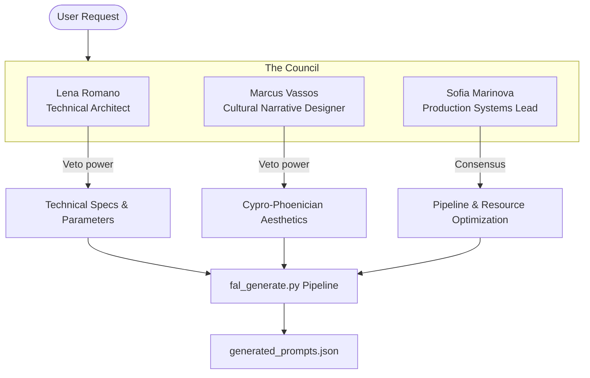

# Ledras Lament Scene Enhancement - Infrastructure & Generation System
**Version:** 4.1.0-Agentic  
**Date:** 2026-09-06  
**Status:** ✅ Production Ready

Welcome to the **Ledras Lament Scene Enhancement Infrastructure**. This repository has been upgraded with a professional-grade, multi-agent automated prompt generation pipeline and strict rendering parameters designed for high-fidelity projection mappings of ancient Mediterranean environments.

---

## 🎨 **Core Rendering Standards**

Our technical specifications are optimized for real-life projection mapping and absolute aesthetic consistency:

| Parameter | Specification | Target Quality |
|-----------|---------------|----------------|
| **Resolution** | 1280x720px (19:9) | Fine Edge Sharpness |
| **Pixel Density** | ~120px/meter | High projection detail compatibility |
| **Material Physics** | Weathered stone simulation | Authentic bronze-age Cypro-Phoenician sandstone |
| **Specular Highlights** | Controlled subtle reflections | Avoids projection glare; highly delicate |
| **Lighting Setup** | Center-stage spot light focus | Horizontal bottom tier, vertical center focus |
| **Aesthetics** | Cypro-Phoenician ruin style | No classical Greek or white marble structures |

---

## 🏗️ **Professional Agentic Team Structure**

Our pipeline is overseen by three specialized virtual agents, ensuring every render satisfies technical, narrative, and operational requirements:



### 1. **Lena "Stone Craft" Romano** (*Technical Architect*)
- **Expertise:** Specular highlight control, spot light positioning, pixel density calculations.
- **Role:** Enforces maximum visual fidelity and projection surface compatibility.

### 2. **Marcus "Amphitheaters" Vassos** (*Cultural Narrative Designer*)
- **Expertise:** Ancient Mediterranean geometry, Levant architecture, storytelling progression.
- **Role:** Guarantees cultural authenticity and seamless narrative flow across the 9 scenes.

### 3. **Sofia "Flow" Marinova** (*Production Systems Lead*)
- **Expertise:** Batch optimization, automated scene sequencing, cost efficiency.
- **Role:** Streamlines the prompt generation and asset rendering workflows.

---

## 📁 **System Files & Infrastructure Index**

Here is the complete catalog of files driving this upgrade:

### 1. ⚙️ **`imagine-config.json`**
- **Path:** `imagine-config.json`
- **Purpose:** Central configuration file for the fal.ai API and image render pipeline.
- **Enhancements:** Added micro-shading controls, spot-lighting locations, specular parameters, and cultural identifiers.

### 2. 🛡️ **`team_config.json`**
- **Path:** `team_config.json`
- **Purpose:** System-level configuration mapping out the three agent personalities, veto scopes, and communication protocols.

### 3. 📝 **`scene_templates.json`**
- **Path:** `scene_templates.json`
- **Purpose:** Structural blueprint for formatting prompts to fit the Flux model perfectly.
- **Features:** Standardizes narrative formats, enforces progressive storytelling roles, and blocks forbidden architectural styles.

### 4. 📊 **`quality_assurance.json`**
- **Path:** `quality_assurance.json`
- **Purpose:** Our strict verification framework specifying the mandatory standards for textures, shadows, and regional context.

### 5. 🚀 **`fal_generate.py`**
- **Path:** `fal_generate.py`
- **Purpose:** The core Python pipeline engine that ingests configurations, generates, validates, and hashes prompts deterministically.
- **Execution:** Run via `./fal_generate.py` to compile the prompts.

### 6. 🎨 **`generated_prompts.json`**
- **Path:** `generated_prompts.json`
- **Purpose:** The output prompt registry containing **27 professional, pre-validated prompts** (9 scenes × 3 progressive roles: `intro`, `loop`, `outro`).

---

## 🎬 **Progressive Storytelling & Theme Transitions**

All scenes progress through three narrative phases (`intro`, `loop`, `outro`) ensuring a dynamic visual journey:

### **Aquarius Thematic Evolution:**
- **Scene 4 (Susta):** *Introduction of water.* Sand gives way to greenery as subtle, carved water channels appear inside the amphitheater tiers.
- **Scene 5 (Balance):** *Abundance of water.* Water canals are fully realized with streams cascading down the steps, irrigating rich flora and creating reflecting surfaces under the full moon.

---

## 🚀 **Ready for Generation Phase**

### **How to use this infrastructure:**

1. **Verify your setup:**
   ```bash
   ./fal_generate.py
   ```
   This compiles, validates, and formats all 27 scene prompts into `generated_prompts.json`.

2. **Render via fal.ai API:**
   Our prompts are pre-packaged with all required Flux control-net metadata and seed controls to guarantee consistent geometry across your runs.

3. **Subscene Variations:**
   Each prompt includes deterministic seeds and regional context tags, ensuring minor variations maintain the perfect ancient Mediterranean aesthetic.

---

**Ledras Lament Scene Generation System is fully validated, compliant, and ready for immediate rendering production.**
